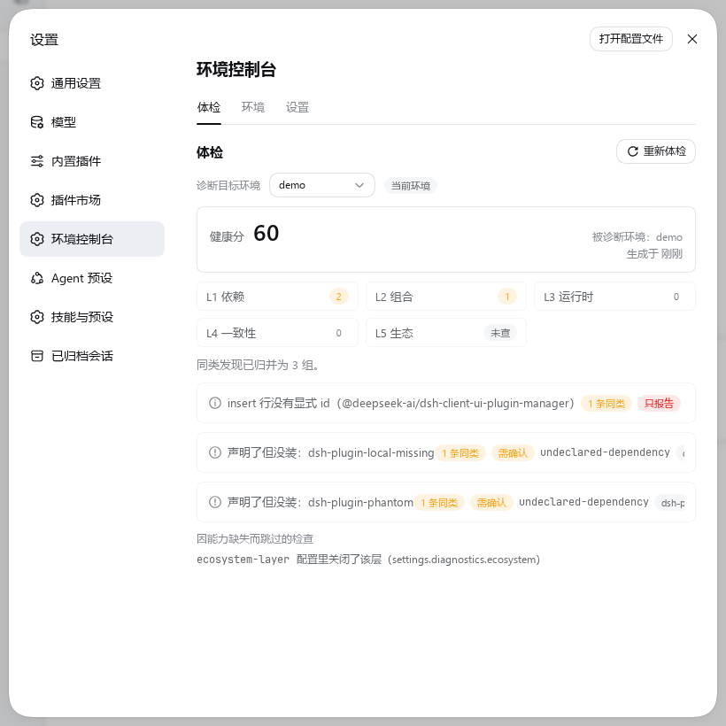
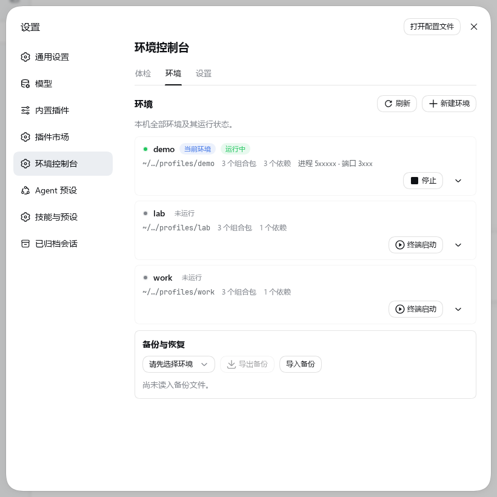
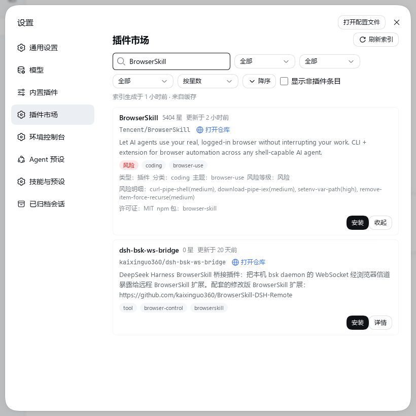
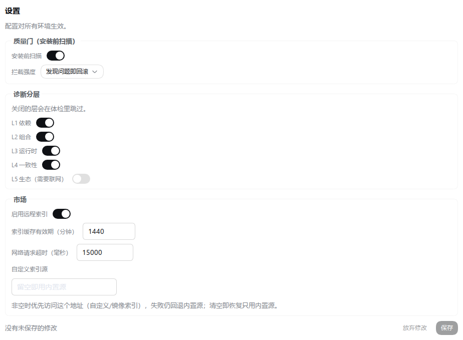

# dsh-plugin-manager-companion

Companion to the official DSH plugin manager: pre-install quality gate, five-layer environment diagnostics, multi-environment management, and a plugin marketplace.

[](https://www.npmjs.com/package/dsh-plugin-manager-companion)
[](LICENSE)

This is a rewrite of [dsh-web-plugin-manager](https://github.com/LX2000WASD/dsh-web-plugin-manager) (0.6.3, unmaintained).
DSH 0.1.6-alpha.2 ships its own plugin management page, which retired the old approach of shadowing that page and writing profile state directly.

[中文说明（主文档）](./README.md)

## Screenshots

| | |
|---|---|
| <br>Five diagnostic layers: grouped findings, each with severity and evidence; unchecked layers read "not checked" | <br>Start, stop, copy and restore across profiles |
| <br>Cards show risk, category and topics; the detail view shows the index text as published | <br>Registered into the official plugin page: opening your own entry shows the configuration form |

## Contents

- [What it does, and what it does not](#what-it-does-and-what-it-does-not)
- [Install](#install)
- [Capabilities](#capabilities)
- [Command line](#command-line)
- [Platform support](#platform-support)
- [Known limitations](#known-limitations)
- [Contributing](#contributing)
- [License](#license)

## What it does, and what it does not

The official plugin manager's README states what it does not do. This plugin fills only those gaps.

| Capability | Official | This plugin |
|---|---|---|
| Enabling and disabling bundles and plugin rows | Present | Not done |
| Installing and removing bundles | Present | Not done (quality gate runs first) |
| Hosting plugin configuration pages | Slots provided | Registers into them |
| Static checks before install | Absent | Quality gate |
| Environment diagnostics | Absent | Environment console · Health check |
| Modifying another profile | Explicitly out of scope | Environment console · Environments |
| Loading plain plugin modules | Declared a file operation | Skills and presets install |
| Version listing and update checks | Explicitly out of scope | Plugin marketplace |

All writes go through official channels: the official `pluginManager` service for the current environment, and the official `runPluginCommand` across environments.
This plugin never writes `cordis.patch.yml` and never invokes pnpm directly.

Verbatim quotes for the four "explicitly out of scope" items, the feature each maps to, and how this plugin steps back if the official side adds them, are in
[docs/OFFICIAL-DEPENDENCIES.md](docs/OFFICIAL-DEPENDENCIES.md) §1-F.

## Install

```sh
dsh plugin --profile <name> add dsh-plugin-manager-companion@latest
```

Requires DSH >= 0.1.6-alpha.2. After installing, enable it on the plugin management page and restart that profile.

## Capabilities

### Quality gate before install

Hooked onto the official `installBundle` "install but do not activate" switch:

1. `inspect(spec)`: the official side reports what this spec points to;
2. `installBundle(spec, { enabled: false })`: the official side installs into the environment without activating;
3. Scan the package: undeclared imports, declared but not installed, official packages declared as plain `dependencies` (which installs a second copy inside the profile and makes the official loader row resolve to it), unresolvable entry points;
4. On failure, `removeBundle` rolls back; on success, `setBundleEnabled` activates.

The trial install is off by default. When enabled, the candidate is first installed into a `<environment>-dpmc` trial environment and started once; only a passing candidate is installed into the real environment. Trial environments have no count limit and are kept for 14 days by default. A trial install really installs the candidate on your machine and runs its install scripts.

### Environment console

One settings entry, three sub-pages:

- **Health check**: five diagnostic layers. Each finding carries evidence (file and line, or a runtime object) and one of three actions: auto-fixable, needs confirmation, report only. The five layers are L1 dependencies, L2 composition, L3 runtime, L4 consistency, L5 ecosystem; a layer that was not checked reads "not checked" rather than 0.
- **Environments**: lists every profile on this machine with its run state (process and port). Supports start (terminal window or background), stop, create, rename, remove, copying plugins across environments, backup export, diff and restore.
- **Settings**: this plugin's configuration, stored in the official settings service and edited in the UI.

### Marketplace, skills and presets

The marketplace page shows the community index, with search over name, repository, topics and description, and sorting by stars, update time and recent activity. Cards show risk level and installability (community pick, manual install, non-plugin entry). Installs go through the quality gate and official channels. The detail view shows the verification verdict and risk details from the index, with a link to the original report.

The skills and presets page manages SKILL.md files and agent presets installed through this plugin: install records, re-fetch, and uninstall.

### Upgrades

The "About" settings page lists version status for the official runtime, official experimental packages, and this plugin itself. Update checks run on demand and can also be triggered manually; version selection lists every dist-tag and preselects the newest one on the same line. Upgrades go through official channels and are verified once in a trial environment first; a version that fails verification is never installed into the real environment. A new version loads at the next start.

## Command line

`dshpmc` offers the same capabilities as the UI, for scripts and CI, for terminal work, and as a fallback when the UI cannot be opened.

```sh
dshpmc analyze --profile <name>   # five-layer health check; exit code 1 when there are findings
dshpmc list    --profile <name>   # composition layers, dependencies, installed skills and presets
dshpmc install | remove | update | mount | uninstall-kind
```

`update <name>` rewrites the dependency declaration to `@latest` and reinstalls. A bare `dsh plugin add` does not upgrade a declared range, and `pnpm update` only re-resolves within the declared range, so crossing versions requires rewriting the declaration. The whole upgrade path is the same one the UI uses.

`analyze` does not need a running instance: it only reads the filesystem, so an environment with a broken configuration file or a failed start still yields a root cause and file lines. When key layers were not checked, it says the conclusion is incomplete instead of reporting healthy.

An agent inside the host process cannot perform plugin writes from the command line: the guard rejects bare `dsh plugin` and `pnpm` mutation commands and points to the official `plugin_manager` tool. `dshpmc` uses the same pnpm channel as that tool, so it is not intercepted.

## Platform support

All checks run on Linux.

**Linux**: verified on real hardware, including unit tests and two end-to-end checks.

**Windows x64**: the official host supports Windows. The platform-specific safety fixes (case-insensitive built-in environment names, process tree termination, quoted command lines, `.cmd` entry points, terminal fallback, cross-platform test entry) were each independently re-verified on a real win32 Node. The following are unverified on real hardware or known not to hold:

- Terminal window mode depends on Windows Terminal (`wt`); machines without it fall back to background start and the result states why.
- File permission bits (0600/0700) are a no-op on Windows; a start log containing an access token is protected only by the profile directory ACL.
- Stopping an environment on Windows is `taskkill /T /F` on the process tree, not a graceful stop; a force-killed instance does not run exit cleanup.
- Installing skill or preset repositories that contain symlinks needs Developer Mode or administrator rights.
- The two end-to-end checks and the screenshot tooling depend on bash and Chrome/CDP; the check entry on Windows is `pnpm test`.
- Unverified: ACLs, service accounts, sessions without a desktop. When enterprise policy disables PowerShell, process information is unreadable and shown as "unknown".

**macOS**: unverified. The filesystem is case-insensitive by default; the case checks shared with Windows already cover it.

## Known limitations

- Only DSH >= 0.1.6-alpha.2 is supported; for earlier versions use 0.6.x from the old repository.
- Two fixes that require changing the structure of `cordis.patch.yml` (removing duplicate rows, removing orphan rows) only produce steps for you to apply. This plugin does not write that file.
- A quality-gate rollback can fail: when the official side refuses to remove a bundle (for example one it protects), the result says what remains and you remove it by hand.
- The install guard intercepts agent tool calls; it does not intercept commands typed in a terminal.
- Sensitive environment-variable filtering matches by shape, not exhaustively; unmatched shapes still reach the git-source install subprocess.
- The L3 registration-name conflict check covers profile-local package sources only, not rows in the official scope.
- A port is known only when the instance command line carries `--port`; a host started on the default port shows "port unknown".
- The L5 ecosystem layer does not go online and does not judge; it is recorded as "not checked".
- Marketplace index and risk grading come from the upstream index; this plugin presents them and makes no second judgment.

## Contributing

Development environment, checks, code layout and the pre-commit checklist are in [docs/DEVELOPMENT.md](docs/DEVELOPMENT.md).
Design in [docs/DESIGN.md](docs/DESIGN.md), engineering policy in [docs/CODE-POLICY.md](docs/CODE-POLICY.md),
host and client contracts in [docs/REST-CONTRACT.md](docs/REST-CONTRACT.md), official facts this plugin depends on in [docs/OFFICIAL-DEPENDENCIES.md](docs/OFFICIAL-DEPENDENCIES.md).

## License

MIT
